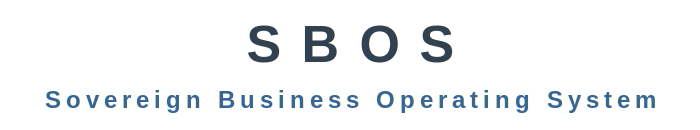

<p align="center">
  <br>
  <a href="https://github.com/SISTEMASSKULL">← SKULL</a>
  <br><br>
  
  <br><br>
  
  <br>
  
  <br><br>
  <strong>"Crecemos junto a ti"</strong>
  <br>
  <sub>"Growing with you"</sub>
</p>

---

El sistema operativo inteligente que unifica, gobierna y asegura los doce dominios de autenticación y control empresarial.

Transforma la fragmentación operativa en control unificado, con identidad verificable en cada dominio y mejora continua sin límites.

---

### Qué resuelve

| | |
|---|---|
| **Identidad** | Un solo login. Permisos que siguen al rol. Accesos revocados al instante. Sin silos. |
| **Fiscalidad** | Facturación electrónica automatizada. Dosificación, emisión, archivo. Sin preocuparse por el SIN. |
| **Trazabilidad** | Cada operación deja huella: quién, desde dónde, en qué empresa, sucursal y momento exacto. |
| **Multi-tenancy** | Una instalación. Múltiples empresas. Aislamiento total por tenant. |

---

### Los Doce Dominios

`D1 Lógico` `D2 Físico` `D3 Financiero` `D4 Biométrico` `D5 Temporal` `D6 Geoespacial` `D7 Red` `D8 Contexto` `D9 Credencial` `D10 Delegación` `D11 Auditoría` **`D12 Blockchain`**

---

### D12 · Blockchain Anchoring

Anclaje criptográfico de auditoría en **Arbitrum One**. Cada hora, todos los eventos se combinan en un árbol Merkle, se calcula una huella única (Keccak256) y se publica en blockchain. Un auditor externo verifica sin confiar en SBOS — solo en matemática y Ethereum ($80B+ en seguridad).

**$0.0002 por lote** · 720 anclajes = $0.15/mes · Computacionalmente imposible de falsificar.

**Productos que D12 habilita:**

| Producto | Para quién |
|----------|------------|
| **Compliance‑in‑a‑Box** | Entidades fiscalizadas: ASFI, UIF, SIN. Cumplimiento verificable sin acceso interno. |
| **IAM Soberano** | Organizaciones que necesitan demostrar control de acceso ante reguladores. W3C DID + VC. |
| **Trust Layer** | Cualquier sistema que necesite verificar eventos sin depender de quien los generó. |
| **Billetera White‑Label** | Operaciones con doble firma, límites programables, conciliación automática y auditoría en blockchain. |

---

### Daemons · infraestructura viva del sistema

#### bos · IAM Installer

*"Gestionando la operatividad de tu infraestructura de negocios."*

Infrastructure Provisioning & Lifecycle Orchestrator. Transforma un servidor vacío en infraestructura empresarial completa. No termina al instalar — sigue vigilando, reconciliando y reparando.

`23 comandos bosctl` · `112+ fichas` · `18 estados` · `JSON-RPC 2.0` · `Unix socket`

#### bauth · Auth Enforce

*"La perfecta gobernanza de identidad y blindaje de acceso total."*

Unified Identity & Permissions Orchestrator. **No es un motor de autenticación — es el director de orquesta** que sincroniza Keycloak, Tryton, OAuth2-Proxy, bhnexus y todos los motores de identidad del ecosistema. Validado contra el patrón Composite Provider de Oracle Helidon.

**BitMask Dual — motor de privilegios profesional:**

- **BitMask Átomo (64 bits):** `Dominio(4) + App(9) + Grupo(11) + Política(2) + Átomo(24)`. Miles de permisos sin colisiones en 110+ aplicaciones.
- **Rol BitMask (N bits):** Vector dinámico. Roles combinados con OR atómico. Herencia con AND NOT — sin intervención humana.
- **Evaluación en nanosegundos.** Sin base de datos en el hot path. Aritmética binaria directa sobre CPU.

**6 responsabilidades simultáneas:**

1. **Sincronizador Maestro** — KC + Tryton en < 5s
2. **Motor de Privilegios** — H-RBAC, BitmaskBundle en JWT
3. **Evaluador en Tiempo Real** — < 5ms, cache Redis TTL 30s
4. **PAP** — única interfaz autorizada para modificar identidad
5. **Gestor de Identidad Física** — QR, biométrico, NFC/RFID
6. **Guardián SoD** — Conflict Matrix + audit log inmutable

**15 métodos de autenticación:** OAuth2/OIDC · SAML · WebAuthn/Passkey · FIDO2 · QR dinámico · NFC/RFID · Biometría · NIST SP 800-63B-4 · mTLS · DPoP (RFC 9449) · Step-Up (RFC 9470) · Token hardware · Certificado digital · PIN

#### bkernel · Data Kernel

*"La integridad absoluta de tus datos, orquestada en tiempo real."*

Universal Data Orchestrator & Integrity Engine. CDC PostgreSQL. Redis Streams. Sin API REST.

#### biedata · Data Integration

*"Trazabilidad y validación perfecta en el intercambio seguro de datos."*

Federated Batch Exchange & Sovereign Data Gateway. La aduana soberana del ecosistema.

#### bsearch · Data RAG

*"Algoritmos de búsqueda de precisión inteligente para localizar cada dato del ecosistema."*

Sovereign Federated Intelligent Search. PostgreSQL 18 nativo: GIN, tsvector, pg_trgm. WebSocket wss://.

#### bhnexus · Nexus Host

*"La orquestación soberana de acceso físico y control multiprotocolo."*

Sovereign Connectivity Broker & Multiprotocol Gateway. OSDP · MQTT · ONVIF. Cache SAM-128 TTL 30s.

#### banexus · Nexus Agent

*"El centinela de borde: ejecución segura y autonomía en el punto de acceso."*

Edge Sentinel & Multi-Input Interceptor. Interceptor USB/shell. Cache AES-256-GCM.

#### bcompass · AI Tools

*"Inteligencia soberana potenciando cada proceso de tu negocio."*

Collaborative & Federated Intelligence. RAG local con Ollama. Sin datos al exterior.

---

### Smart · cara visible del ecosistema

| Marca | Producto | Eslogan |
|-------|----------|---------|
| **btax** | SmartTax · Strategic Tax Compliance & Management | *"La certeza institucional en tu cumplimiento tributario."* |
| **bpay** | SmartPay · Integrated QR Resolution & Payment Gateway | *"La interfaz unificada para la trazabilidad y control total de pagos."* |
| **brates** | SmartRates · Exchange Rate & Currency Intelligence | *"La navegación financiera perfecta."* |
| **breport** | SmartReport · Document & Analytics Engine | *"Cada dato, un documento. Cada documento, una decisión."* |
| **borc** | SmartORC · Correspondence Receipt & Operational Response | *"Trazabilidad perfecta en tu gestión documental."* |
| **bvault** | SmartVaultFlow · Secure Document Repository & Workflow | *"Tu memoria documental de acceso seguro."* |
| **bportfolio** | SmartPortfolio · Custom Asset Curation & Catalog | *"La precisión comercial de catálogos y multimedia."* |

---

### En un comando

```bash
curl -sSL https://get.sbos.sh | sudo bash
```

---

### Stack

`Ubuntu 26.04 LTS` `K3s 1.32` `PostgreSQL 18.4` `Redis 8.6` `Keycloak 26.6` `Vault 2` `Kong 3.9` `Go 1.26` `Rust 1.85` `Calico CNI` `Linkerd mTLS` `Arbitrum One` `Keccak256` `Merkle Trees`

---

### Estándares

`ISO/IEC 27001:2022` `NIST SP 800-207` `NIST SP 800-63B-4` `FIPS 203/204/205` `ANSI/INCITS 359-2004 H-RBAC` `PCI-DSS v4.0` `W3C DID Core 1.1` `FIDO2/WebAuthn` `CIS Kubernetes Benchmark v8`

---

<p align="center">
  <sub>SBOS · <a href="https://github.com/SISTEMASSKULL">SKULL © 2026</a></sub>
</p>
